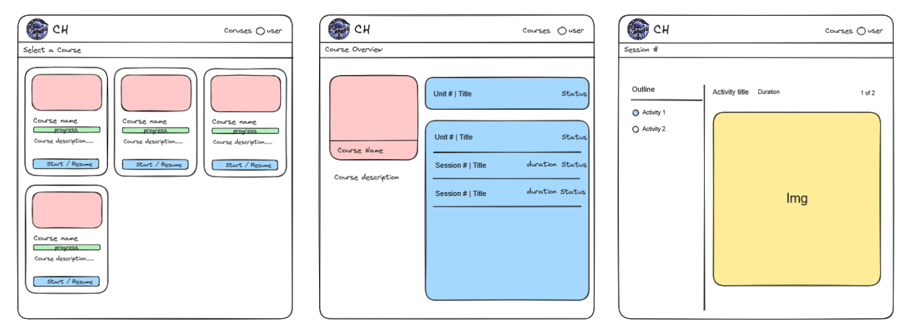

# Cosmic Hall 🌌

A basic learning platform built with Next.js 15, headless ui, and Clerk, designed to provide an engaging course experience for curious minds.


*Platform wireframes showing course selection, course overview, and session views*

## Features ✨

- **Course Selection**: Browse and select from available courses with static progress tracking
- **Basic Course Overview**: Comprehensive view of course units, sessions, and progress(WIP)
- **Interactive Sessions**: Structured learning activities with estimated duration tracking for each session
- **Responsive Design**: Mobile and Desktop friendly experience 
- **User Authentication**: Login and user management using Clerk.

## Tech Stack 🛠️

- [Next.js 15](https://nextjs.org/) - React framework
- [TypeScript](https://www.typescriptlang.org/) - Javascript Superset
- [Headless UI](https://headlessui.com/) - UI Components
- [Tailwind CSS](https://tailwindcss.com/) - Styling
- [Clerk](https://clerk.com/) - Authentication

## Prerequisites 📋

- Node.js 18.17 or later
- pnpm (preferred) or yarn or npm

## Installation 🚀

1. Clone the repository:
```bash
git clone https://github.com/Bcantrell1/cosmic-hall.git
```

2. Navigate to the project directory:
```bash
cd cosmic-hall
```

3. Install dependencies:
```bash
pnpm install
# or
npm install
# or
yarn
```

4. Create a `.env.local` file in the root directory:
```env
NEXT_PUBLIC_CLERK_PUBLISHABLE_KEY=your-public-clerk-key
NEXT_PUBLIC_CLERK_SIGN_IN_URL=/sign-in
NEXT_PUBLIC_CLERK_SIGN_UP_URL=/sign-up
CLERK_SECRET_KEY=your-clerk-key
```

5. Start the development server:
```bash
pnpm run dev
# or
yarn dev
# or
npm dev
```

Open [http://localhost:3000](http://localhost:3000) with your browser to see the result.

## TODO List 📝

- [ ] Add database and ORM for progress tracking
- [ ] Implement course search and filtering
- [ ] Add course completion certificates
- [ ] Add support for different content types (video, quizzes, assessments)
- [ ] Create admin dashboard for statistics
- [ ] Implement user feedback system
- [ ] Host on Google Cloud Platform instead of vercel

## Contribute to my project 🤝

1. Fork the project
2. Create your feature branch (`git checkout -b feature/AmazingFeature`)
3. Commit your changes (`git commit -m 'Add some AmazingFeature'`)
4. Push to the branch (`git push origin feature/AmazingFeature`)
5. Open a Pull Request

## License 📄

This project is licensed under the [MIT License](LICENSE) - see the LICENSE file for details.

## Contact 📧

Brian Cantrell - cantrellbrian546@gmail.com

Project Link: [https://github.com/Bcantrell1/cosmic-hall](https://github.com/Bcantrell1/cosmic-hall)